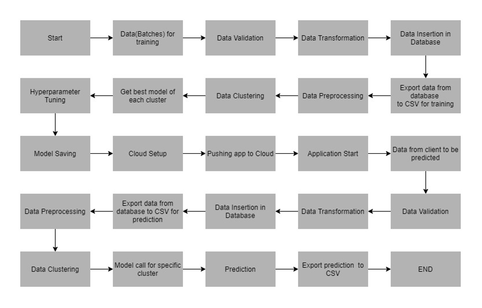

# END-TO-END-ML-PipelineProject-CreditCardDefaulters

# Problem Statement #
To build a classification methodology to determine whether a person defaults the credit card payment for the next month

### Architecture used in this project ###

### Technologies Used ###

      
  
  
  
    

### Algorithms Used ###
## KMeans, Naïve Bayes, XGBoost, GridSearch ,AUC Scores ##
